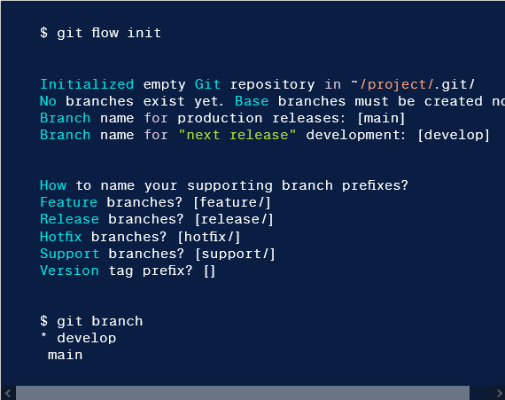

# Exercice 8 : commandes GitFlow

A partir des commandes GitFlow suivantes, proposez les équivalents avec les commandes de base de `git`.

## Commande 1

## Commande 2

## Commande 3

## Commande 4

## Commande 6

## Commande 7

## Commande 8

